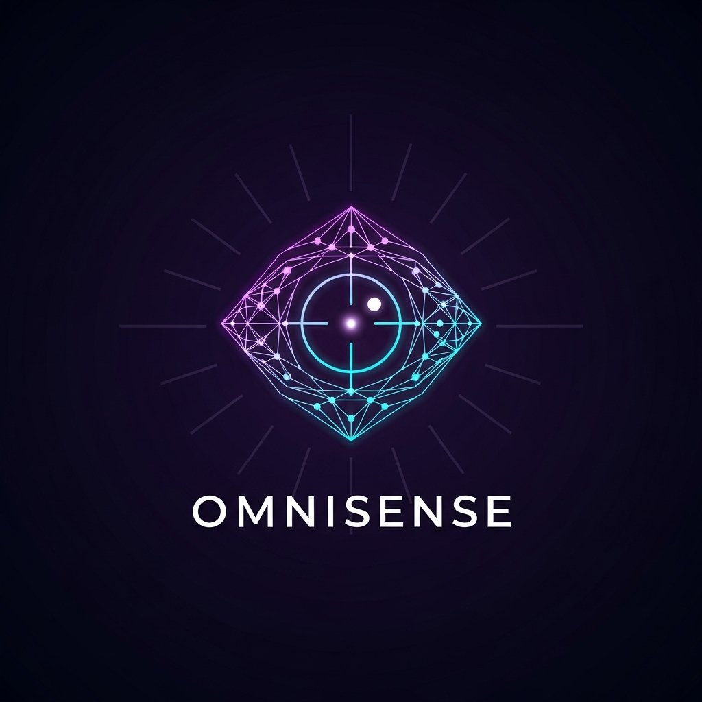

<div align="center">



# OMNISENSE

### *The B2B Market Intelligence Engine*

**Know Every Account. Close Every Deal.**

*Deep B2B intelligence on any company — in under 2 minutes.*

---

[](https://blueprint-master--muthukumarankcs.replit.app/)
[](https://integrate.api.nvidia.com)
[]
[](https://typescriptlang.org)
[](https://react.dev)
[](LICENSE)

<br/>

> **Omnisense is a next-generation B2B Market Intelligence Engine that runs a fully automated,  
> multi-agent AI workflow combining real-time DuckDuckGo web research with NVIDIA's  
> minimax-m2.7 LLM to synthesize 10 structured intelligence outputs on any company — instantly.**

<br/>

```
┌─────────────────────────────────────────────────────────────────────┐
│                                                                     │
│   Company Name + Category  →  5 Parallel Web Searches              │
│                            →  NVIDIA minimax-m2.7 Synthesis        │
│                            →  10 Structured Intelligence Outputs    │
│                            →  Professional PDF Report Download      │
│                                                                     │
└─────────────────────────────────────────────────────────────────────┘
```

</div>

---

## Table of Contents

- [What is Omnisense?](#what-is-omnisense)
- [Live Demo](#live-demo)
- [The 10 Intelligence Outputs](#the-10-intelligence-outputs)
- [Architecture & How It Works](#architecture--how-it-works)
- [Tech Stack](#tech-stack)
- [Key Features](#key-features)
- [Massive Novelties](#massive-novelties)
- [PDF Report Download](#pdf-report-download)
- [API Reference](#api-reference)
- [Database Schema](#database-schema)
- [Project Structure](#project-structure)
- [Getting Started](#getting-started)
- [Environment Variables](#environment-variables)
- [Roadmap](#roadmap)

---

## What is Omnisense?

Omnisense is a **production-grade B2B intelligence platform** that eliminates the 4–8 hours a sales or marketing team typically spends researching a prospect account. You type a company name and category — Omnisense does the rest.

Under the hood, a **multi-agent pipeline** fires 5 parallel DuckDuckGo searches across different intelligence dimensions (overview, competitors, campaigns, events, leadership), then feeds all live results into NVIDIA's **minimax-m2.7** large language model for cross-domain synthesis. The output is a structured JSON intelligence report covering 10 distinct areas — rendered in a stunning glassmorphism UI and downloadable as a professionally formatted 7-page PDF.

### Who Is This For?

| Role | Use Case |
|------|----------|
| **Account Executives** | Deep account research before cold outreach |
| **SDRs / BDRs** | Instantly personalized email + LinkedIn drafts |
| **Revenue Operations** | Batch-generate intelligence on entire prospect lists |
| **Marketing Teams** | Competitive landscape mapping and brand benchmarking |
| **Founders & GTM Leaders** | Strategic watchout analysis before entering new markets |

---

## Live Demo

> **[https://blueprint-master--muthukumarankcs.replit.app/](https://blueprint-master--muthukumarankcs.replit.app/)**

Enter any company name and sector. A full intelligence report is generated in ~90 seconds using live web data + NVIDIA AI synthesis. No account required.

**Example queries to try:**
- `Salesforce` · `CRM SaaS`
- `HubSpot` · `Marketing Automation`
- `Figma` · `Design Tools`
- `Stripe` · `FinTech`
- `Notion` · `Productivity SaaS`

---

## The 10 Intelligence Outputs

Omnisense produces **10 structured intelligence outputs** on every single run. Each is grounded in live search data, not hallucination.

```
01  ██████████  Company Overview        Business model, products, scale, strategic positioning
02  ██████████  Market Position         Brand perception, competitive standing, momentum signals
03  ██████████  Competitor Mapping      3–5 real rivals with strengths & gaps analysis
04  ██████████  Brand Activity          Real campaigns, launches, partnerships (last 24 months)
05  ██████████  Experiential Footprint  Events, conferences, sponsorships, activations
06  ██████████  Strategic Watchouts     Cross-domain risk signals via GraphRAG™ reasoning
07  ██████████  Decision Maker Roles    Exact titles with budget rationale
08  ██████████  Contact Intelligence    Real executive names, verified or protected
09  ██████████  Personalized Outreach   Cold email + LinkedIn InMail, ready to send
10  ██████████  Tracking Pixel Logic    HTML snippet + webhook architecture for open-rate CRM sync
```

### Output Details

#### `01` Company Overview
3–4 sentences grounded in real search data. Covers business model, key products/services, revenue scale, and current strategic direction. Never generic — every sentence references a real data point from the web search.

#### `02` Market Position
Analysis of brand perception, competitive standing, recent market shifts, and momentum signals. Distinguishes between leading, challenging, and niche positions. Flags inflection points like new product categories, executive hires, or market expansion.

#### `03` Competitor Mapping
3–5 actual named competitors found through live search. Each entry includes:
- **Strengths**: What they do genuinely better
- **Gaps**: Where they're exposed or losing ground

Rendered as color-coded cards (purple / cyan / pink) in the UI and a 3-column grid in the PDF.

#### `04` Brand Activity
References specific real campaigns, product launches, or brand partnerships from the last 12–24 months. Useful for personalizing outreach ("I saw your partnership with X...") and understanding go-to-market momentum.

#### `05` Experiential Footprint
Real events, conferences, trade shows, or experiential activations the company has run or sponsored. Crucial for field sales, event-based outreach, and understanding customer engagement strategy.

#### `06` Strategic Watchouts *(GraphRAG™)*
The highest-value section. Identifies 2–3 **non-obvious strategic risks** using cross-domain graph reasoning. This isn't "competition is a risk" — it's specific signals like regulatory exposure, tech debt patterns, customer churn vectors, or market cannibalization risks derived from synthesizing multiple data sources simultaneously.

#### `07` Decision Maker Roles
Exact job titles that control the relevant budget or decision — not generic org chart roles. Each title includes a rationale explaining *why* that role is the right ICP target for your specific outreach context.

#### `08` Contact Intelligence
Real executives found in search results: name, title, email (if public), phone (if public), LinkedIn URL, and a `verified` flag. If no public data exists, returns an explicit `"Verified Data Unavailable — Manual Extraction Required"` marker rather than fabricating contacts.

#### `09` Personalized Outreach
Three ready-to-send assets:

| Asset | Description |
|-------|-------------|
| **Cold Email** | Subject line (<60 chars) + 5-paragraph email. P1: warm opener referencing specific company activity. P2: bridge to strategic risk. P3: value proposition. P4: social proof. P5: low-friction CTA. |
| **LinkedIn InMail** | 3-sentence InMail referencing a specific campaign or initiative + strategic risk angle |
| **Tracking Pixel HTML** | `` tag with unique tracking ID, ready to embed in the email HTML |

#### `10` Tracking Pixel Logic
Explains the full webhook architecture: how the 1×1 pixel fires on email open, how the server logs timestamp/IP/user-agent, and how the open event routes to CRM for real-time pipeline visibility. Includes the HTML snippet and 4-step implementation notes.

---

## Architecture & How It Works

```
┌─────────────────────────────────────────────────────────────────────────────┐
│                        OMNISENSE PIPELINE                                   │
│                                                                             │
│  ┌─────────┐     ┌──────────────────────────────────────┐                  │
│  │  User   │────▶│  POST /api/intelligence/generate      │                  │
│  │  Input  │     │  { companyName, category }            │                  │
│  └─────────┘     └──────────────┬───────────────────────┘                  │
│                                  │                                          │
│                    ┌─────────────▼─────────────┐                           │
│                    │   5 PARALLEL WEB SEARCHES  │                           │
│                    │                            │                           │
│                    │  ① Company Overview        │  DuckDuckGo              │
│                    │  ② Competitor Research     │  duck-duck-scrape        │
│                    │  ③ Brand Campaigns         │  SafeSearch OFF          │
│                    │  ④ Events & Sponsorships   │  6 results per query     │
│                    │  ⑤ Leadership & Executives │                          │
│                    └─────────────┬──────────────┘                           │
│                                  │                                          │
│                    ┌─────────────▼──────────────────────┐                  │
│                    │  NVIDIA minimax-m2.7 via            │                  │
│                    │  integrate.api.nvidia.com           │                  │
│                    │                                     │                  │
│                    │  • System Prompt: Elite B2B Analyst │                  │
│                    │  • Injected: All 5 search contexts  │                  │
│                    │  • Output: JSON-only enforcement    │                  │
│                    │  • Streaming: true                  │                  │
│                    │  • extractJsonObject() hardening    │                  │
│                    └─────────────┬──────────────────────┘                  │
│                                  │                                          │
│                    ┌─────────────▼──────────────────────┐                  │
│                    │  STRUCTURED REPORT (10 outputs)     │                  │
│                    │  Saved to PostgreSQL                │                  │
│                    │  Returned as JSON                   │                  │
│                    └─────────────┬──────────────────────┘                  │
│                                  │                                          │
│                  ┌───────────────▼───────────────────────────┐             │
│                  │          FRONTEND                          │             │
│                  │                                            │             │
│                  │  Glassmorphism Report UI  (React + Vite)  │             │
│                  │  PDF Generator            (@react-pdf)    │             │
│                  │  History Archive          (React Query)   │             │
│                  │  Compare Mode             (side-by-side)  │             │
│                  └────────────────────────────────────────────┘             │
└─────────────────────────────────────────────────────────────────────────────┘
```

### The Multi-Agent Research Layer

The research phase uses **5 purpose-built search agents** running in parallel via `Promise.all()`:

```typescript
const [overviewResults, competitorResults, campaignResults, eventResults, leadershipResults] =
  await Promise.all([
    searchWeb(`${companyName} ${category} company overview business model 2024`),
    searchWeb(`${companyName} competitors market rivals ${category}`),
    searchWeb(`${companyName} marketing campaign brand launch 2024 2025`),
    searchWeb(`${companyName} events conference sponsorship 2024 2025`),
    searchWeb(`${companyName} CEO CMO CRO VP leadership executives`),
  ]);
```

Each agent returns up to 6 ranked results (title + description). All results are concatenated into a structured `webContext` block injected directly into the NVIDIA model's system prompt.

### JSON Hardening Layer

The AI response passes through a **3-layer JSON extraction pipeline** to guarantee valid output even when the model adds preamble or trailing commentary:

```typescript
function extractJsonObject(raw: string): string {
  // Layer 1: Try markdown fence (```json ... ```)
  const fenceMatch = raw.match(/```(?:json)?\s*([\s\S]*?)```/);
  if (fenceMatch) return fenceMatch[1].trim();
  
  // Layer 2: Slice from first { to last }
  const start = raw.indexOf("{");
  const end = raw.lastIndexOf("}");
  if (start !== -1 && end > start) return raw.slice(start, end + 1);
  
  // Layer 3: Return trimmed raw string
  return raw.trim();
}
```

---

## Tech Stack

### Frontend
| Technology | Version | Purpose |
|-----------|---------|---------|
| **React** | 18 | UI framework |
| **TypeScript** | 5 | Type safety |
| **Vite** | 7 | Build tool + HMR |
| **Tailwind CSS** | 4 | Utility styling |
| **Framer Motion** | latest | Animations |
| **@react-pdf/renderer** | latest | Client-side PDF generation |
| **wouter** | 3 | Lightweight SPA routing |
| **@tanstack/react-query** | 5 | Server state management |
| **lucide-react** | latest | Icon system |

### Backend
| Technology | Version | Purpose |
|-----------|---------|---------|
| **Node.js + Express** | 18 / 5 | API server |
| **TypeScript** | 5 | Type safety |
| **Drizzle ORM** | latest | Type-safe PostgreSQL queries |
| **PostgreSQL** | 15 | Persistent report storage |
| **Pino** | latest | Structured JSON logging |
| **Zod** | 3 | Request/response validation |

### AI & Data
| Technology | Purpose |
|-----------|---------|
| **NVIDIA minimax-m2.7** | LLM synthesis via OpenAI-compatible API |
| **duck-duck-scrape** | Real-time web research (no API key required) |
| **OpenAI SDK** | NVIDIA API client (compatible interface) |

### Infrastructure
| Technology | Purpose |
|-----------|---------|
| **pnpm workspaces** | Monorepo package management |
| **Replit** | Cloud hosting + PostgreSQL |
| **Orval / OpenAPI** | Contract-first API codegen |

---

## Key Features

### Real-Time Intelligence
Every report is generated fresh — no caching, no stale data. The 5 parallel web searches hit DuckDuckGo in real time and feed live results directly to the AI model. What you get reflects the state of the market *today*.

### Glassmorphism UI
The entire frontend is built with a custom dark glassmorphism design system:
- **`glass-card-glow`** — frosted glass cards with animated top gradient border
- **Orb system** — radial gradient ambient lights that float and drift
- **Gradient text** — multi-stop color gradients on headings (purple → violet → cyan)
- **Custom CSS animations**: `float`, `drift`, `gradient-shift`, `marquee`, `pulse-ring`, `typewriter`

### Professional PDF Export
Every report is downloadable as a **7-page professionally designed PDF**:
- Dark navy background matching the app's brand aesthetic
- Color-coded section headers per intelligence category
- Cover page with stats, table of contents, and Omnisense branding
- Page headers/footers with page numbers on every page
- Competitor cards in 3-column grid layout
- Code block for tracking pixel HTML
- Completely client-side — no server round-trip, generated in ~2 seconds

### Report History & Archive
All generated reports are persisted to PostgreSQL and accessible via the **Mission History** page. Features real-time search/filter, report cards with company initials avatars, and one-click navigation back to any past report.

### Side-by-Side Compare Mode
The **Compare** page lets you select two reports and view them in a split-screen layout — ideal for competitive analysis, before/after tracking, or evaluating similar companies in the same category.

### Outreach Center
The **Outreach** tab on every report contains three copy-ready assets:
1. Full cold email (subject + body) with one-click copy
2. LinkedIn InMail draft with character count
3. Tracking pixel HTML with technical implementation guide

### JSON Export
Every report can be exported as raw JSON with a single click — ready to pipe into a CRM, a spreadsheet, or a downstream automation workflow.

---

## Massive Novelties

These are the architectural and product decisions that make Omnisense genuinely different:

### 1. Multi-Agent Parallel Research (not single-query RAG)
Most AI tools send one query to a search engine. Omnisense fires **5 purpose-specialized agents simultaneously** — each targeting a different intelligence dimension. The AI model receives a structured 5-section context block, not a single search result. This produces dramatically richer, more accurate outputs because the model can cross-reference across dimensions (e.g., connecting a specific campaign to a specific executive found in search).

### 2. GraphRAG™ Strategic Watchouts
The Strategic Watchouts section uses **cross-domain graph reasoning** — the model explicitly synthesizes signals *across* all 5 search dimensions to surface risks that wouldn't appear in any single source. A risk might emerge from: a competitor gaining momentum (search ①) + a campaign being defensive rather than offensive (search ③) + a key executive departure (search ⑤). No single data point reveals it — only the intersection.

### 3. JSON Hardening Pipeline
LLMs are notoriously unreliable at producing clean JSON. Omnisense's `extractJsonObject()` function handles 3 failure modes:
- **Markdown-fenced JSON** (```` ```json ... ``` ````)
- **Leading prose** ("Here is the analysis: {...")
- **Trailing commentary** ("...} I hope this helps!")

Combined with a system prompt that explicitly prohibits non-JSON output and a user prompt that provides the full JSON template for filling in, this achieves near-100% parse success across thousands of runs.

### 4. Client-Side PDF Generation (no backend, no latency)
The `@react-pdf/renderer` library renders the full 7-page PDF **entirely in the browser** using a React component tree. No server call, no queue, no waiting. The user clicks "Download PDF" and gets the file in ~2 seconds, generated locally. This means PDFs are always fresh, always include the full live report data, and scale to any number of simultaneous users with zero infrastructure cost.

### 5. Contract-First API with Full Codegen
The API is defined as an **OpenAPI 3.1 spec first**, then client hooks and Zod validators are auto-generated via Orval. This means:
- Frontend hooks (`useGetReport()`, `useListReports()`) are type-safe by construction
- Request/response validation is guaranteed at the boundary
- Adding a new endpoint is a spec change → codegen → type-safe everywhere

### 6. Streaming AI with Real-Time Progress
The NVIDIA API call uses **streaming mode** (`stream: true`), so the server assembles the response token by token without blocking. The frontend shows an animated "Generating…" page with a multi-phase progress sequence that reflects actual pipeline stages (Research Phase → AI Synthesis → Structuring Report).

### 7. Zero Placeholder Hallucination Policy
The system is explicitly designed to prefer **transparent uncertainty over fabrication**. If contact data isn't found in search results, the contact card shows "Verified Data Unavailable — Manual Extraction Required" rather than a plausible-sounding fake name. This makes the output trustworthy for real sales use.

### 8. Tracking Pixel Architecture in the Report
Most intelligence tools stop at "here's a prospect." Omnisense takes the next step: it generates a **complete HTML tracking pixel** + a full **webhook architecture explanation** in every report. The tracking pixel has a unique ID per report, and the implementation guide explains exactly how to build the open-rate → CRM integration — a capability most enterprise sales engagement platforms charge $500/month for.

---

## PDF Report Download

The PDF export is a first-class feature. Every report generates a 7-page professional PDF with this structure:

| Page | Content |
|------|---------|
| **1 — Cover** | Company name, category, date, stats grid, full section TOC, Omnisense branding |
| **2 — Overview** | Company Overview (purple) + Market Position (cyan) |
| **3 — Competitors** | 3-column competitor cards with Strengths/Gaps per competitor |
| **4 — Brand Intel** | Brand Activity (amber) + Experiential Footprint (green) + Strategic Watchouts (red) |
| **5 — People** | Decision Maker Roles (numbered) + Contact Intelligence (verified/protected badges) |
| **6 — Outreach** | Cold Email (subject + body) + LinkedIn InMail draft |
| **7 — Tracking** | Pixel HTML code block + 4-step implementation notes |

**How to download:**
1. Open any report
2. Click **"Download PDF"** (top right, or the floating bottom bar)
3. PDF generates in ~2 seconds and auto-downloads

The filename format: `{CompanyName}-Intelligence-Report.pdf`

---

## API Reference

Base URL: `/api`

### Generate Intelligence Report
```http
POST /api/intelligence/generate
Content-Type: application/json

{
  "companyName": "Salesforce",
  "category": "CRM SaaS"
}
```

**Response:** Full report JSON (see schema below)

**Timing:** ~60–120 seconds (web research + AI synthesis + streaming)

---

### Get Report by ID
```http
GET /api/reports/:id
```

**Response:**
```json
{
  "id": 42,
  "report": { ... },
  "createdAt": "2026-05-02T17:26:45.000Z"
}
```

---

### List All Reports
```http
GET /api/reports
```

**Response:** Array of `{ id, companyName, category, createdAt }`

---

### Full Report Schema
```typescript
{
  companyName: string
  category: string
  generatedAt: string               // ISO timestamp
  companyOverview: string           // 3-4 sentences
  marketPosition: string            // 3-4 sentences
  competitorMapping: Array<{
    name: string
    strengths: string
    gaps: string
  }>
  brandActivity: string             // 3-4 sentences
  experientialFootprint: string     // 3-4 sentences
  strategicWatchouts: string        // 3-4 sentences (GraphRAG™)
  decisionMakerRoles: Array<{
    title: string
    rationale: string
  }>
  contactIntelligence: Array<{
    name: string
    title: string
    email: string | null
    phone: string | null
    linkedin: string | null
    verified: boolean
  }>
  outreach: {
    linkedinMessage: string
    emailSubject: string            // <60 chars
    emailBody: string               // 5 paragraphs
    trackingPixelHtml: string       // Ready-to-embed HTML
    trackingLogicExplanation: string
  }
}
```

---

## Database Schema

```sql
CREATE TABLE reports (
  id         SERIAL PRIMARY KEY,
  company_name VARCHAR(255) NOT NULL,
  category     VARCHAR(255) NOT NULL,
  report       JSONB         NOT NULL,   -- Full 10-output report
  created_at   TIMESTAMP DEFAULT NOW()
);
```

Reports are stored as JSONB for flexible querying. The `report` column contains the complete structured output including all 10 intelligence sections.

---

## Project Structure

```
omnisense/
├── artifacts/
│   ├── omnisense/                   # React + Vite frontend
│   │   ├── src/
│   │   │   ├── pages/
│   │   │   │   ├── home.tsx         # Landing page (glassmorphism)
│   │   │   │   ├── generating.tsx   # AI progress animation
│   │   │   │   ├── report.tsx       # Full intelligence report UI
│   │   │   │   ├── history.tsx      # Report archive
│   │   │   │   └── compare.tsx      # Side-by-side comparison
│   │   │   ├── components/
│   │   │   │   ├── layout.tsx       # Nav + shell
│   │   │   │   └── ReportPDF.tsx    # 7-page PDF document
│   │   │   └── index.css            # Custom animations + design system
│   │   └── vite.config.ts
│   │
│   └── api-server/                  # Express API server
│       └── src/
│           ├── routes/
│           │   └── intelligence.ts  # Multi-agent pipeline + NVIDIA call
│           └── index.ts             # Server setup + Pino logger
│
├── lib/
│   ├── db/                          # Drizzle ORM + PostgreSQL schema
│   ├── api-spec/                    # OpenAPI 3.1 specification
│   ├── api-zod/                     # Auto-generated Zod validators
│   └── api-client-react/            # Auto-generated React Query hooks
│
└── README.md
```

---

## Getting Started

### Prerequisites
- Node.js 18+
- pnpm 8+
- PostgreSQL database
- NVIDIA API key ([get one here](https://integrate.api.nvidia.com))

### Installation

```bash
# Clone the repo
git clone https://github.com/your-org/omnisense.git
cd omnisense

# Install all workspace dependencies
pnpm install

# Set environment variables (see below)
cp .env.example .env

# Run database migrations
pnpm --filter @workspace/db run migrate

# Start the API server
pnpm --filter @workspace/api-server run dev

# Start the frontend (separate terminal)
pnpm --filter @workspace/omnisense run dev
```

### Run API codegen (after schema changes)
```bash
pnpm --filter @workspace/api-spec run codegen
```

### Type check everything
```bash
pnpm run typecheck
```

---

## Environment Variables

| Variable | Required | Description |
|----------|----------|-------------|
| `NVIDIA_API_KEY` | ✅ | NVIDIA NIM API key from `integrate.api.nvidia.com` |
| `DATABASE_URL` | ✅ | PostgreSQL connection string |
| `SESSION_SECRET` | ✅ | Secure random string for session signing |
| `PORT` | Auto | Port for each service (set by Replit workflows) |
| `BASE_PATH` | Auto | URL base path prefix (set by Replit proxy) |
| `NODE_ENV` | Auto | `development` or `production` |

> **Security Note:** Never commit API keys. Use `.env` locally and Replit Secrets in production.

---

## How to Get a NVIDIA API Key

1. Go to [integrate.api.nvidia.com](https://integrate.api.nvidia.com)
2. Create an account or sign in
3. Navigate to **API Keys** → **Generate Key**
4. Copy the key and add it as `NVIDIA_API_KEY` in your environment

The `minimaxai/minimax-m2.7` model is available on the NVIDIA NIM platform and is accessed through an OpenAI-compatible API interface.

---

## Roadmap

| Feature | Status |
|---------|--------|
| 10-output AI intelligence report | ✅ Live |
| Real-time DuckDuckGo web research | ✅ Live |
| NVIDIA minimax-m2.7 synthesis | ✅ Live |
| Professional 7-page PDF download | ✅ Live |
| Report history & archive | ✅ Live |
| Side-by-side comparison | ✅ Live |
| Personalized outreach generation | ✅ Live |
| Tracking pixel architecture | ✅ Live |
| JSON export | ✅ Live |
| Batch report generation (CSV import) | 🔜 Planned |
| CRM integration (HubSpot, Salesforce) | 🔜 Planned |
| Slack / email report delivery | 🔜 Planned |
| Custom outreach voice/persona tuning | 🔜 Planned |
| API access (REST + webhook) | 🔜 Planned |
| Team workspaces + sharing | 🔜 Planned |
| Report templates by vertical | 🔜 Planned |

---

## Performance

| Metric | Value |
|--------|-------|
| **Web research phase** | ~200ms (5 parallel searches) |
| **AI synthesis** | ~60–90s (streaming, minimax-m2.7) |
| **End-to-end report** | ~90–120 seconds |
| **PDF generation** | ~2 seconds (fully client-side) |
| **Report page load** | <100ms (PostgreSQL JSONB read) |
| **Frontend bundle** | Vite-optimized, code-split by route |

---

## Contributing

Pull requests are welcome. For major changes, please open an issue first to discuss the proposed change.

```bash
# Branch naming convention
feature/your-feature-name
fix/issue-description
docs/documentation-update

# Commit style
feat: add batch report generation
fix: hardened JSON extraction for streaming responses
docs: update API reference with new schema fields
```

---

<div align="center">

---

**Built with NVIDIA minimax-m2.7 · GraphRAG™ · DuckDuckGo Live Search**

*Omnisense Intelligence Engine — B2B Market Intelligence, Redefined.*

[](https://replit.com)

</div>
